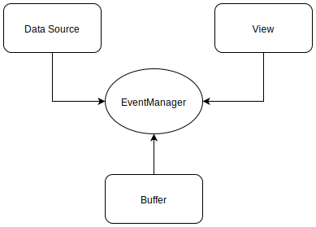
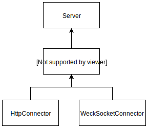
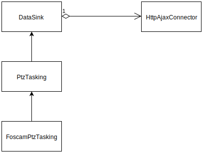
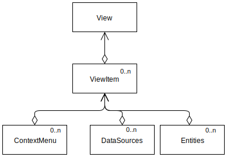

Architecture
===

### Global architecture

The toolkit can be splitted into five parts:

 1) The Event manager: a global bus to communicate between components
 
 2) The data sources (data providers): they are connected to the server to get the data. They are represented under many types such as binary, text etc.
 
 3) The buffer: every data got from the data sources are handled by the buffer. It allows data synchronization and buffering
 
 4) The stylers: map the json data to graphic properties
 
 5) The views: rendering divs and general rendering options

### Event Manager

It acts as an Event bus, it connects the data sources, views and buffer.
 
It contains Event enumeration such as:

 * DATA-&lt;id&gt;: gets the specific data after the buffering process

 * CONNECT_DATASOURCE-&lt;id&gt;: sends an event to connect a specific data source

 * PTZ_SEND_REQUEST-&lt;id&gt;: handles request to send (such as SPS)

 * ...
 
 If the event concerned a data, it is often postfix with the id of the concerned data sources.
  
### Data connector

The Toolkit use the data connector Abstract class to get/send the data. This is the link between the client and
the OSH server. It does not contain any logic and gets only the data through two ways:

 * WebSocket API: connects to the server using the WebSocket Javascript API. The connector is encapsulated into
 a WebWorker if it is supported by the browser
 
 * Http API: connects to the server using the XmlHttpRequest API
 
 
 
 
### Data Receiver & Data Sender
 
A Data Receiver/Sender is used to parse the data got from the SOS server. The data contains a timestamp 
and the raw data. The timestamp has to be separated to be used into the buffer to process synchronization.
It is also in charge to build the final url given:

* protocol: specify the protocol (data connector) to use

* endpoint: the sos endpoint url

* offering: the specific offering id

* observedProperty: the specific observed property

* start time: the begin position

* end time: the end position

* replay speed: because the Toolkit allows synchronization, you can use real-time data as well as playback data. 
The replay speed allows one to accelerate the time for the playback one.

* (See technical details)[#technical-data-receiver]
  
#### Data Receiver - SOS

By default, the data receiver uses the WebSocket API. The WebSocket is used inside a non-blocking Web Worker.
Using WebWorkers allows the Application to get multiple data into different threads and does not block the 
main Thread (the rendering divs).
As part of the data receiver package, some have already been implemented:

 

A generic data receiver has been implemented to handle textual data got from SOS server [See OSH.DataReceiver.JSON](http://opensensorhub.github.io/osh-js/Toolkit/Documentation/OSH.DataReceiver.JSON.html).
To implement your own data receiver, you have only to extend [OSH.DataReceiver.DataSource](http://opensensorhub.github.io/osh-js/Toolkit/Documentation/OSH.DataReceiver.DataSource.html) and implement
the `parseData()` as well as the `parseTimeStamp()` which are in charge of separate the timestamp and the raw data from the SOS stream.

#### Data Sender - SPS

The data sender allows one to send requests to the server. Usually it is used to send SPS requests (for example in case of PTZ tasking).

Like the Data Receiver, an abstract class has to be inherited and provides necessary functions to simplify the request building chain. 

 

### Buffer

Every data got from the SOS stream are sent to the buffer (using the EventManager). It can synchronize the data and handle playback/real-time. 
Once the data are processed by the buffer, they are send back to the bus through the EventManager to be processed by the other components (Views, Stylers etc..).
The buffer can be used as a standalone component as well as into the [OSH.DataReceiver.DataReceiverController](http://opensensorhub.github.io/osh-js/Toolkit/Documentation/OSH.DataReceiver.DataReceiverController.html).

The DataReceiver is a helper class to wrap and abstract some logic. It uses a single buffer instance and callback the result to the EventManager.

 

### Data receiver/sender(R/S) VS entity

An entity is a set of data R/S. It makes the link between several Data R/S defined by different views:

 * one click onto a view representing a data can highlight another view representing another data contained in the same entity
 
 * it allows firing group events such as show, hide, highlight
 

  
### The views

A view represent one or more data. It gets the data from the EventManager. A view is defined by one or more ViewItems. A viewItem is composed of:

 * a styler
 
 * a contextual menu
 
 * an array of entity ids
 
 * an array of data receivers
  
Some views don't need view items such as:

 * Range slider
 
 * Discovery
 
 * Dialog
 
 They kind of views don't represent the data, they do not have direct link with a data receiver.
 
 

### Stylers

The stylers allow one to style the data. They are generic and use functions to filter the input data. Once the data has been processed by the styler, the result is sent back to the view 
and displayed. Many kind of stylers are available:

 * text
 
 * icon 
 
 * line
 
 * map point
 
 * ...
 
 They are not mandatory.
 
###  Context menus
 
They are a set of abstract class to represent a menu. They can have manu representations such as circular, stack etc. They are built from `menuItems` owning:
 
 * name: the name of the menu
 
 * viewId: a link to the view
 
 * css classes: to style the menu
 
 A `menuItem` makes the link between the view and the context menu (through event messages).

